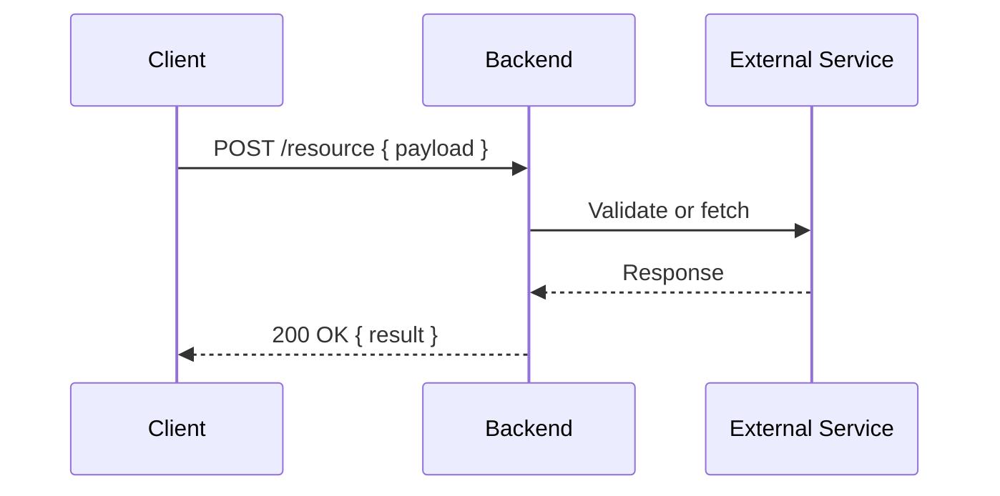
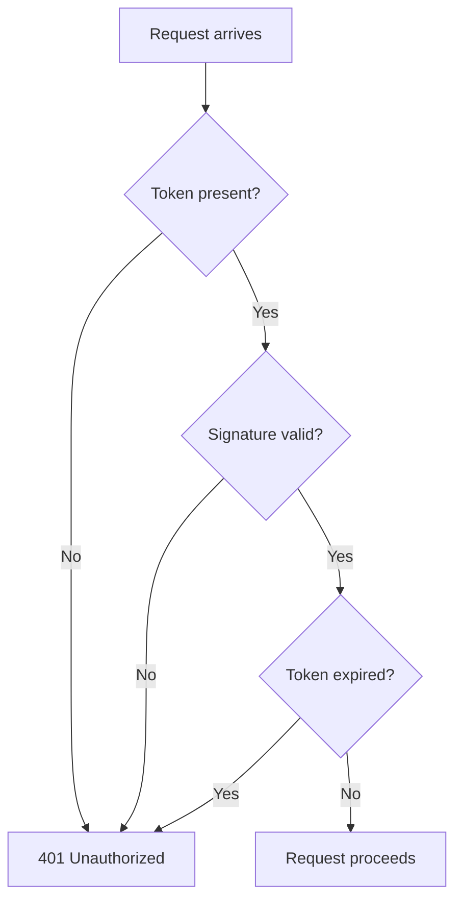

# Diagram Standards

> Portable rule file. Copy `.claude/rules/` to any new repository to apply these conventions.
> Applies to: any project that maintains flow diagrams in documentation.

---

## When to Use Each Format

| Situation | Format |
|---|---|
| Flow between two or more systems or actors | Mermaid `sequenceDiagram` |
| Decision logic, branching conditions, state | Mermaid `flowchart TD` |
| Simple unidirectional relationship or quick inline reference | ASCII diagram |
| Tabular reference data | Markdown table |

**Default:** prefer Mermaid when the diagram has more than two actors or more than one decision point. Use ASCII when the relationship is a single arrow or a two-party exchange that reads clearly as text.

---

## Mermaid — sequenceDiagram

Use for flows between actors: client, backend, external service, auth provider.



**Rules:**
- Always label participants with short aliases (`C`, `B`, `E`)
- Use `->>` for requests, `-->>` for responses
- Use `Note over X,Y: text` for annotations
- Use `alt` / `else` / `end` for branching within a sequence

---

## Mermaid — flowchart TD

Use for decision logic and branching conditions.



**Rules:**
- Use `TD` (top-down) by default; use `LR` (left-right) only for wide, flat flows
- Rectangles `[]` for actions/states, diamonds `{}` for decisions, rounded `()` for start/end
- Always show both branches of a decision (Yes/No or success/failure)

---

## ASCII Diagram

Use for simple two-party exchanges or quick inline references in prose documentation.

```
[Service A]                        [Service B]
  │                                    │
  │  POST /resource { payload }        │
  │ ──────────────────────────────►    │
  │                                    │
  │  200 OK { result }                 │
  │ ◄──────────────────────────────    │
```

**Rules:**
- Use `│` for vertical lines, `─` for horizontal, `►` / `◄` for directional arrows
- Label boxes with `[Name]` or `(Name)`
- Add inline comments to the right of the arrow line

---

## File Location and Naming

All diagram files live in `docs/diagrams/`. One file per flow or subsystem. Filename uses kebab-case and describes the subject:

```
docs/diagrams/
├── auth-flow.md
├── token-lifecycle.md
├── password-reset-flow.md
└── consumer-api-integration.md
```

---

## When to Create or Update a Diagram File

Create or update a diagram file whenever:
- A new flow is implemented as part of a phase
- An existing flow changes behavior
- A decision is made that affects how systems interact (new D-XXX entry)

Diagram files are updated as part of the `/docs phase-N` step, not the `/execute` step.

---

## Diagram File Structure

Every diagram file must follow this structure:

```markdown
# [Flow Name]

> Last updated: Phase N — Month Year

## Overview

One paragraph describing what this flow does and why it exists.

## Actors

| Actor | Description |
|---|---|
| Client | Browser or mobile app — initiates the flow |
| Backend | Main application server |
| External Service | Third-party dependency (if applicable) |

## Flow Diagram

[Mermaid or ASCII diagram here]

## Step-by-Step

Numbered prose explanation of each step in the diagram.

## Error Cases

What happens when each step fails — status codes and relevant events.

## Related Decisions

Links to D-XXX entries in decision_log.md that govern this flow.
```
